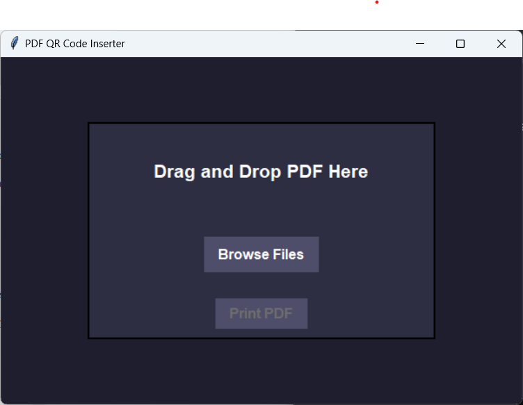

# PDF QR Code Inserter with Google Drive Integration and Drag-and-Drop UI

A powerful and user-friendly desktop application built with Python that allows users to:

- Upload PDF files to Google Drive
- Automatically generate and embed a QR code linking to the uploaded file
- Drag-and-drop or manually browse PDF files
- Instantly open or print the modified PDFs with ease

---

## 🚀 Features

- ✅ **Drag and Drop Support** – Effortlessly drop your PDFs into the app.
- ✅ **Google Drive Upload** – Automatically uploads your PDF to Google Drive and generates a public shareable link.
- ✅ **QR Code Embedding** – Generates a QR code from the shareable link and embeds it into every page of the PDF.
- ✅ **Print or Open PDFs** – Instantly print or open the modified document.
- ✅ **Modern GUI** – Clean and responsive interface using `TkinterDnD2`.

---

## 🛠 Requirements

- Python 3.7+
- Google API credentials (`credentials.json`)

### Install dependencies:

```bash
pip install -r requirements.txt

## 🖼 UI Preview

### 🔹 Main Interface
